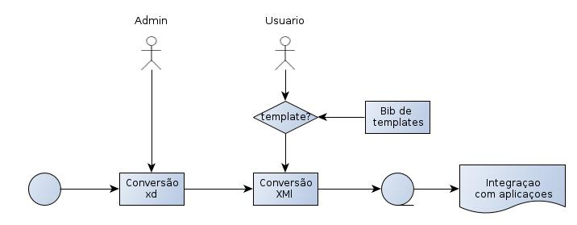

jats2tex
========

Descrição do projeto
--------------------

Um conversor de *xml*  para ConTeXt, que 
segue a documentação do SciELO Publishing Schema.

Trata-se, basicamente, de uma aplicação de linha de comando que pode ser 
executada via *prompt*, podendo ser usado para 
a conversão de arquivos em massa, localmente, ou como 
parte integrada de qualquer aplicação, conforme o exemplo:

```
jats2tex <Arquivo>.xml -o <Arquivo.tex>
```

É possível referenciar um template ConTeXt específico:

```
# uso com templates .tex
jats2tex <Arquivo>.xml -t <template> -o <Arquivo.tex>
```


Microservice
------------

O projeto inclui ainda um *microservice* ou servidor que 
recebe arquivos *xml* via *post* e devolve arquivos *.tex. 

MultiSchemas
-------

O conversor pode servir ainda para outros esquemas de *xml* (*.xd). 
A correspondência entre os blocos de *xml* e os comandos *tex*
pode ser feita em uma aplicação *web*.

Separação de Metatados
---------

Para a integração do xml, os metadados dos livros estará disponível em arquivo separados (Ex: "título", "autor"), em formato Json. O conversor é responsável por ler este metadados e criar um arquivo .tex que disponibiliza as variáveis (Ex: \title, \author) para uso em lugares específicos.  

Tecnologia
==========

* Ferramentas [xml nativas do ConTeXt](http://wiki.contextgarden.net/XML).
* xslt
* Haskell & Pandoc



Piloto
-------------------

Fizemos uma prova de conceito que pode ser acessada [neste endereço](beijaflor-jatex.herokuapp.com).


